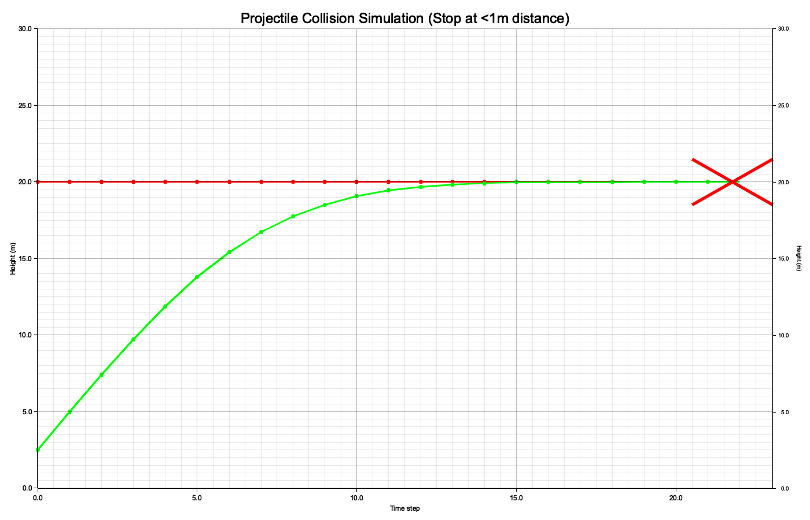
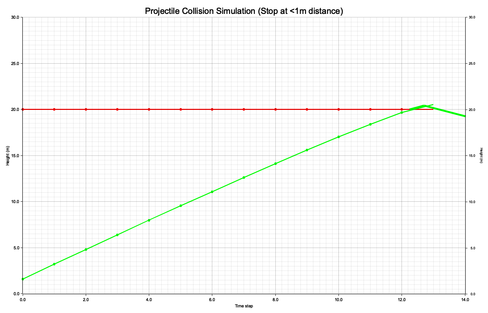

# Projectile Collision Simulation

A Rust-based simulation of two projectiles where one pursues the other until they collide. The simulation includes visualization with angle analysis between velocity vectors at collision.

## Current Simulation Result




## Projectile Parameters

### Red Projectile (Target)
- **Initial Position**: (0.0, 30.0)
- **Initial Velocity**: (2.0, 0.0) m/s
- **Flight Height**: 30.0 meters (constant horizontal flight with random evasion)
- **Movement**: Moves horizontally with random angular deviation (-5° to +5°) and P-controller correction
- **Speed**: 2.0 m/s
- **Target Height Correction**: P-gain of 0.2 with 60% correction weight

### Green Projectile (Pursuer)
- **Initial Position**: (0.0, 0.0)
- **Initial Velocity**: (0.0, 0.0) m/s (starts at rest)
- **Flight Height**: Ground level (0.0 m) - rises to intercept target
- **Movement**: Steered towards predicted collision point with red projectile
- **Speed**: 2.5 m/s (constant after acceleration)

## Simulation Parameters

- **Collision Threshold**: < 1.0 meter distance
- **Time Steps**: Up to 1000 steps
- **Interceptor Speed**: 2.5 m/s (constant)
- **Target Evasion**:
  - Random angle deviation: -5° to +5°
  - P-Controller gain: 0.2
  - Correction weight: 0.6 (60% correction, 40% random)
  - Target height maintenance: 30.0 meters
- **Angle Threshold**: Collision result indicator
  - **Green Checkmark**: Angle > 5°
  - **Red X**: Angle ≤ 5°

## Assignment Challenge

### Objective
Modify the `calculate_steering_direction()` function to achieve a collision with an angle **greater than 5 degrees**.

### Testing
Run the simulation with:
```bash
cargo run
```

The output shows:
- Collision time step
- Positions and velocities at collision
- Angle between velocity vectors
- Visual indicator (✅ for >5°, ❌ for ≤5°)

### Visualization Examples

#### Example 1:


#### Example 2:


The simulation generates collision simulation images showing:
- Red line: Target trajectory
- Green line: Pursuer trajectory  
- Dots: Position at each time step
- Green checkmark or red X: Collision point indicator

## Building and Running

```bash
cargo build
cargo run
```

The graph will be saved as `collision_simulation.png` in the project directory.
